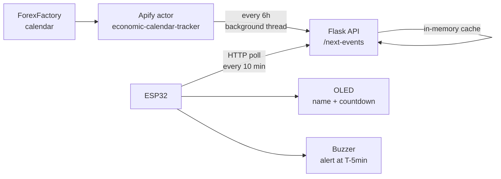

# Economic Calendar Clock

A desk device that shows the next major macroeconomic release (CPI, NFP, FOMC, ECB)
and counts down to it, with an audible alert before it drops. No phone, no screen,
no tab open — just look up.

https://github.com/user-attachments/assets/c2b6b21f-2392-41ae-992e-89652c02800b

## How it works



The Apify run takes ~30 seconds, which is far longer than an ESP32's HTTP timeout,
so it never happens inside a request. A background thread keeps the cache warm and
`/next-events` answers instantly from memory.

## API

`GET /next-events` — upcoming high-impact events, soonest first, times in UTC:

```json
[
  { "name": "Main Refinancing Rate", "datetime": "2026-09-10T12:15:00" },
  { "name": "Core CPI m/m",          "datetime": "2026-09-11T12:30:00" }
]
```

`GET /status` — cache age, event count, and the last background error. Check this
first when the device shows nothing.

## Hardware

| Component | Pin | ESP32 |
|---|---|---|
| OLED (SSD1306) | VCC | 3V3 |
| | GND | GND |
| | SCL | D22 |
| | SDA | D21 |
| Active buzzer | + | D25 |
| | − | D26 |

The buzzer's `−` goes to a GPIO, not GND: the firmware holds D26 low and it acts as
the ground return. If you wire `−` straight to GND instead, that works too — but the
`pinMode(BUZZER_N, OUTPUT)` line is what makes the D26 version work, so don't drop it.

Avoid GPIO 1 and 3 (RX0/TX0). Anything wired there blocks uploads.

## Running it

```bash
pip install -r requirements.txt
cp .env.example .env        # add your Apify token
python app.py
```

Then copy `esp32_econ_clock/arduino_secrets.example.h` to `arduino_secrets.h`,
fill in your WiFi and the API URL, and flash the sketch.

**Arduino libraries:** Adafruit SSD1306, Adafruit GFX, ArduinoJson.
**Board:** ESP32 Dev Module.

### Deploying

The `Procfile` runs it under gunicorn with `--workers 1` — that matters. The refresh
thread starts at import, so multiple workers means duplicate Apify runs, duplicate
billing, and separate caches the device would hit at random.

Set `APIFY_TOKEN` in the host's environment; `.env` is gitignored and won't travel.

## Notes

- The Apify actor silently ignores unknown input keys. `{"impact": ["high"]}` looks
  reasonable and does nothing — the real keys are `highImpactOnly` and `upcomingOnly`.
- Dataset fields are `title` and `date_iso` (offset-aware), not `date_utc`. Some
  records have no `title` at all.
- Free hosting tiers sleep after ~15 minutes idle, which is shorter than the poll
  interval, so a cold boot returns `503 warming_up`. The firmware retries after 45s.
- Read the response with `http.getString()`, never `http.getStream()`. gunicorn
  replies chunked, and the raw stream still holds the chunk-size lines — ArduinoJson
  parses that leading hex length as a valid number and hands back an empty array
  with no error. Flask's dev server sends `Content-Length`, so it only breaks in
  production.
